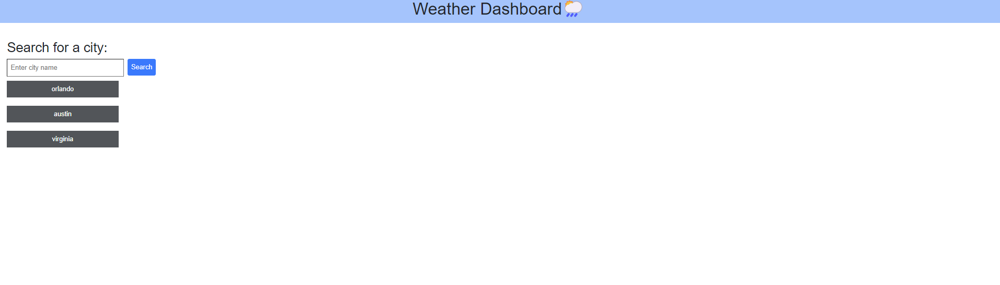
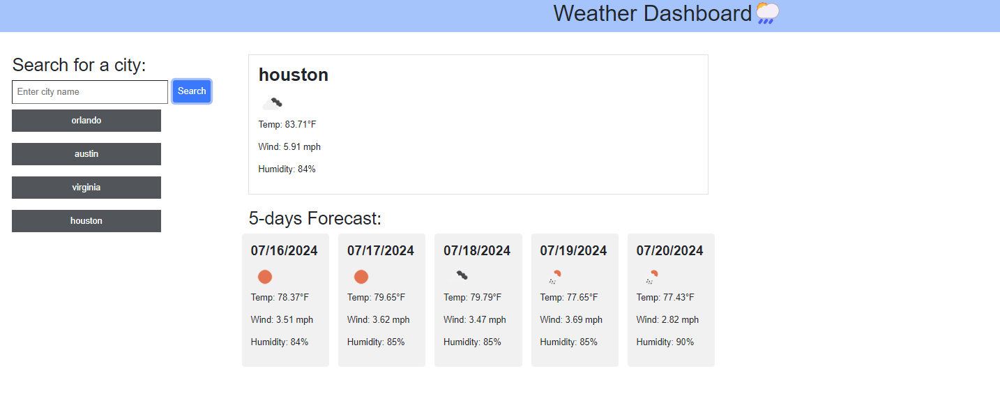

# weather-dashboard

## Description

A weather dashboard to display 5 day weather condition of the city

## Installation

N/A

## Usage

A simple weather dashboard to display the current weather and 5-days weather forecast of the city user searched for.

## Screenshots

The following screenshots shows the tasks board's appearance

## Codebase

You can find the project repository [here](https://github.com/shreyareddy6/weather-dashboard.git)

You can find the deployed page [here](https://shreyareddy6.github.io/weather-dashboard/)

## Credits

N/A

## License

Please refer to the LICENSE in the repo.
